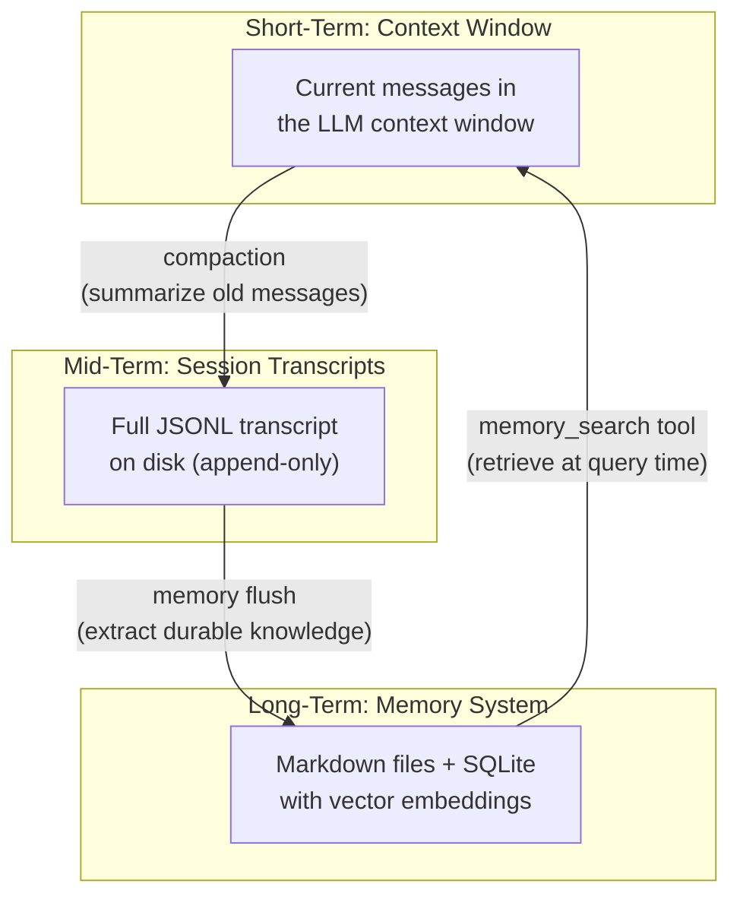
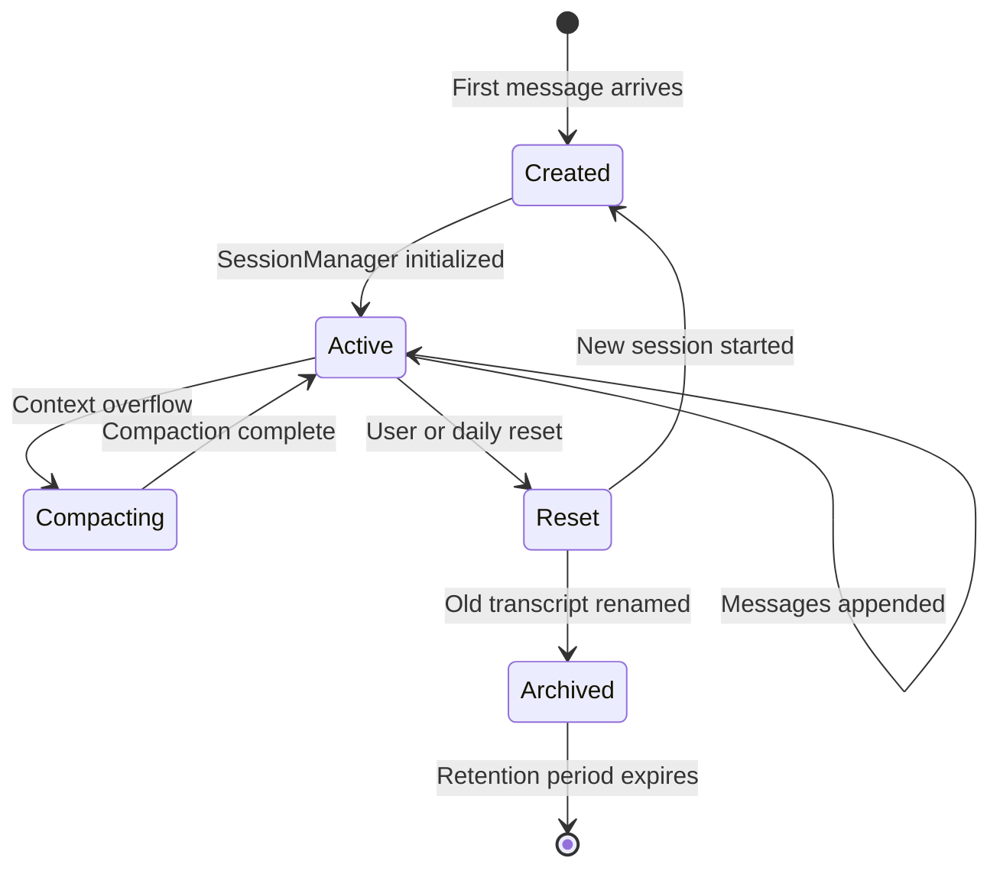
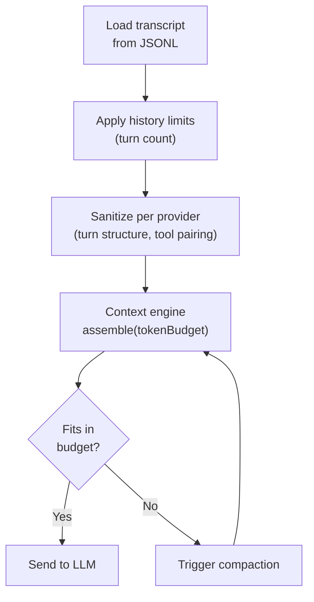
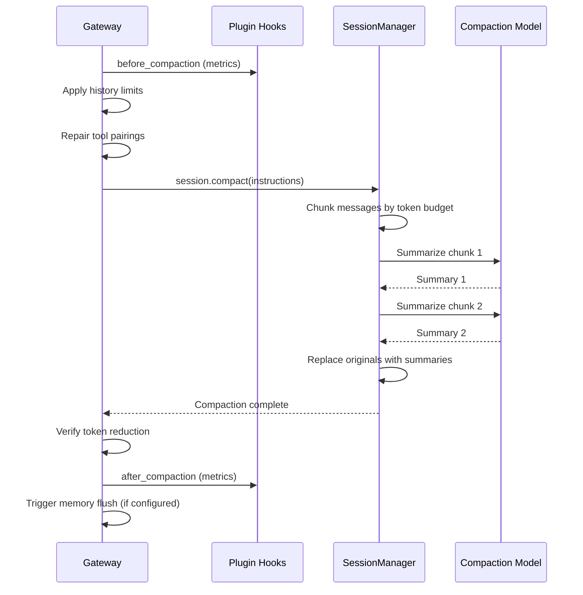
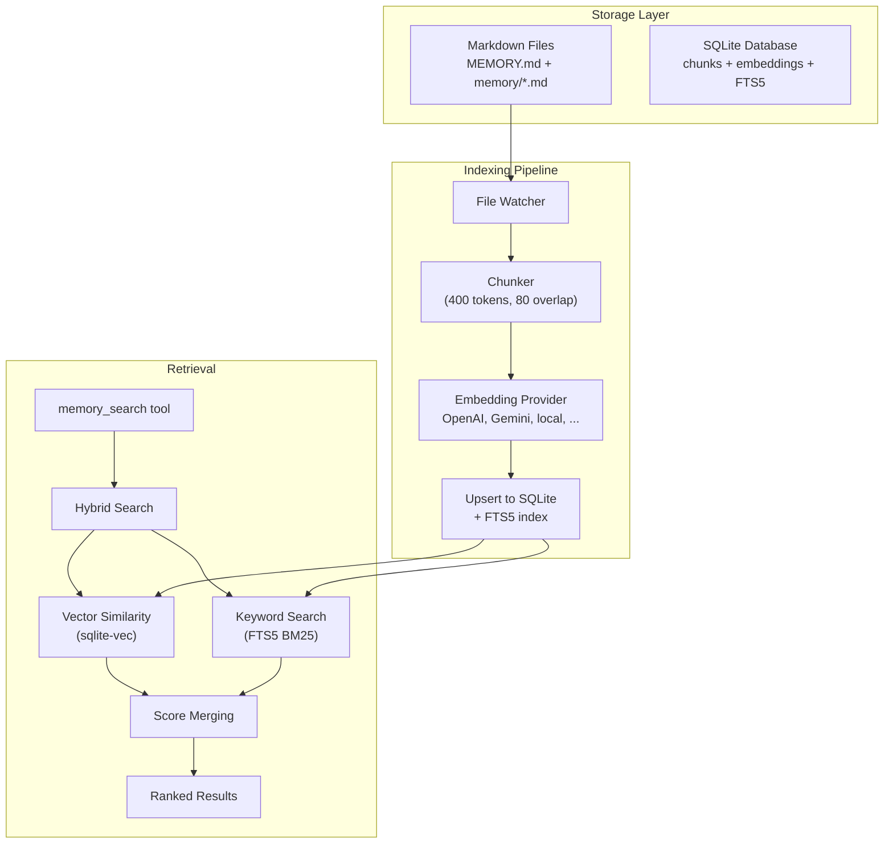
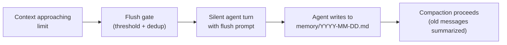
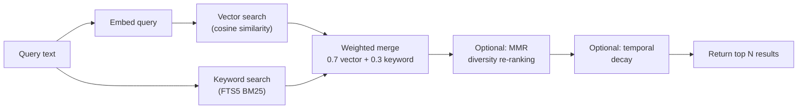
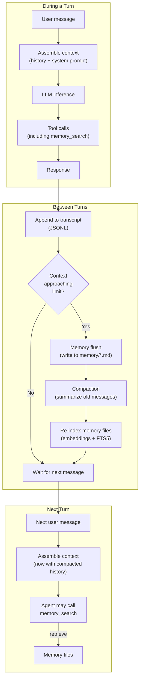

# Context and Memory

OpenClaw manages information across three timescales, each with its own storage mechanism
and lifecycle. Understanding this layered design is key to understanding how OpenClaw
maintains coherent, long-running conversations.



| Layer | What it stores | Lifetime | Storage |
|---|---|---|---|
| **Context window** | Messages currently visible to the LLM | Single turn (rebuilt each inference call) | In-memory |
| **Session transcript** | Complete conversation history | Session lifetime (days to weeks) | JSONL files |
| **Long-term memory** | Durable knowledge extracted from conversations | Indefinite | Markdown files + SQLite |

The three layers form a cycle: context overflows into transcripts via **compaction**,
transcripts overflow into memory via **memory flush**, and memory is pulled back into
context via **tool-based retrieval**.

---

## Layer 1: Session Transcripts

### JSONL Format

Each conversation is persisted as an append-only JSONL file. Every line is a JSON object:

```
Line 1 (header):   {"type":"session", "version":3, "id":"uuid", "timestamp":"...", "cwd":"..."}
Line 2 (message):  {"type":"message", "id":"m1", "parentId":null, "message":{"role":"user", ...}}
Line 3 (message):  {"type":"message", "id":"m2", "parentId":"m1", "message":{"role":"assistant", ...}}
...
Line N (compaction): {"type":"compaction", "id":"c1", ...}  (summary replacing earlier messages)
```

Messages form a **parentId chain** — each message points to its predecessor, creating a
directed acyclic graph. This chain is the source of truth for message ordering and is
used by the compaction system to slice history correctly.

**Location:** `~/.openclaw/state/agents/{agentId}/sessions/{sessionId}.jsonl`

### Session Keys

A **session key** uniquely identifies a conversation context. It encodes who is talking,
through which channel, and to which agent:

| Pattern | Example | Meaning |
|---|---|---|
| `agent:main:main` | Default DM | Per-sender default session |
| `agent:main:+15551234` | Phone-based DM | Specific sender identity |
| `slack:group:C123456` | Slack channel | Group conversation |
| `{base}:thread:999` | Thread | Sub-conversation within a session |

The session key determines which transcript file to load and which `SessionEntry`
metadata record to use.

### Session Lifecycle



**Creation.** When a message arrives for a new session key, OpenClaw creates a JSONL
file with a session header, assigns a UUID, and writes the initial `SessionEntry` to
`sessions.json`.

**Active.** Messages are appended via `SessionManager.appendMessage()`, which maintains
the parentId chain. Metadata (tokens, costs, timestamps) is updated in the session store.

**Reset.** Triggered by user command (`/new`, `/reset`), daily reset schedule, or idle
timeout. The old transcript is archived with a `.reset.{timestamp}` suffix, and a fresh
session starts with a new UUID.

**Archive.** Old transcripts are pruned after a retention period (default 30 days).
Session store entries are capped (default 500) and rotated when the JSON file exceeds
10 MB.

### Session Hierarchy

Sessions can form parent-child relationships in two ways:

**Subagent spawning.** A parent agent spawns a child session via the subagent tool. The
child gets its own transcript, model, and tools. Results bubble back to the parent.

```
Parent session (orchestrator)
  -> Child session 1 (leaf agent, spawnDepth=1)
  -> Child session 2 (leaf agent, spawnDepth=1)
```

**Thread forking.** When a user starts a thread (e.g., Telegram topic), OpenClaw forks a
new session from the parent's current state. The fork gets a `parentSessionKey` pointer
and `forkedFromParent: true`.

### Message Queue

Each session maintains an in-memory queue for handling rapid-fire messages:

| Mode | Behavior |
|---|---|
| `steer` | New message replaces the current (steers the conversation) |
| `followup` | New message queued and processed after current turn |
| `collect` | Messages collected and batched |
| `queue` | Strict FIFO queue |
| `interrupt` | Current turn aborted, new message processed immediately |

Configurable per session with debounce, cap, and drop policies.

---

## Layer 2: Context Window Management

### The Problem

LLMs have finite context windows (typically 128K-200K tokens). A long conversation can
exceed this limit. OpenClaw solves this with a combination of **history limiting**,
**context assembly**, and **compaction**.

### Context Engine Interface

**Location:** `src/context-engine/types.ts`

OpenClaw defines a pluggable `ContextEngine` interface:

```typescript
interface ContextEngine {
  bootstrap?()              // Initialize for a session
  maintain?()               // Periodic maintenance (cleanup/optimize)
  ingest(message)           // Add a message to the engine's store
  ingestBatch?(messages)    // Batch add
  assemble(tokenBudget)     // Build context that fits the budget
  compact()                 // Reduce context size
  afterTurn?()              // Post-turn lifecycle work
  dispose?()                // Cleanup
}
```

This interface allows third-party plugins to provide custom context management strategies
(e.g., RAG-augmented context, sliding window with summaries, etc.).

### Context Window Resolution

The effective context window is determined by:

1. Model's native context window (e.g., 200K for Claude)
2. User config override: `agents.defaults.contextTokens`
3. Hard minimum: 16K tokens
4. Warning threshold: 32K tokens

The available budget is then split:

```
Total context window
  - System prompt tokens
  - Bootstrap context tokens
  - Tool definition tokens
  - Response reserve (~30%)
  = Available for conversation history
```

### History Limiting

Before context assembly, old messages are truncated based on configuration:

| Setting | Scope | Default |
|---|---|---|
| `historyLimit` | Channel conversations | Varies by channel |
| `dmHistoryLimit` | DM conversations | Varies by channel |
| Per-DM override | Specific user | Optional |

This is a coarse-grained mechanism that caps the number of turns, independent of token
counting.

### Context Assembly Flow



Per-provider sanitization ensures the message sequence is valid for the target model:
- **Anthropic:** Validate turn alternation, preserve thinking signatures
- **Google/Gemini:** Validate turn structure, filter tools by capabilities
- **OpenAI:** Minimal sanitization, image-only processing
- **Mistral:** Strict tool ID handling

### Transcript Repair

After history truncation, messages may have dangling references (e.g., a tool result
without its corresponding tool call). `sanitizeToolUseResultPairing()` repairs these
automatically — orphaned tool results are removed, and incomplete pairs are cleaned up.

---

## Layer 3: Compaction

When the context window overflows, OpenClaw runs **compaction** — an automatic
summarization process that replaces old messages with concise summaries.

### Compaction Flow



### Compaction Algorithm

**Chunking.** Messages are split into chunks that fit within the compaction model's
context window. A 1.2x safety margin is applied to token estimates. Oversized messages
(>50% of context) are handled separately.

**Staged summarization.** For very long histories, compaction runs in stages — summarize
chunks individually, then summarize the summaries. `summarizeInStages()` handles this
recursively.

**Token-aware splitting.** `splitMessagesByTokenShare()` divides messages by their token
distribution, not by count. This prevents a few large messages from dominating a chunk.

**Quality safeguards.** Compaction summaries are audited for quality. If summarization
degrades, a structured fallback format (JSON with extracted tool operations and file
changes) is used instead.

### Compaction Triggers

| Trigger | When |
|---|---|
| **Overflow** | Token budget exceeded during context assembly |
| **Manual** | User runs `/compact` command |
| **Timeout** | Configurable compaction timeout |
| **Proactive** | Approaching limit (configurable threshold) |

### Fallback Hierarchy

If full summarization fails:

1. **Full summarization** — Summarize all messages in chunks
2. **Partial summarization** — Exclude oversized messages, summarize the rest
3. **Notation-only** — Just record message counts and metadata (no LLM call)

### Compaction Model

Compaction can use a different (cheaper/faster) model than the conversation model. This
is configured via `agents.defaults.compaction.model`.

---

## Layer 4: Long-Term Memory

Long-term memory persists knowledge **across sessions**. Unlike transcripts (which are
per-session and eventually archived), memory is durable and searchable.

### Architecture



### Source of Truth: Markdown Files

Memory is stored as **plain Markdown files** in the agent's workspace:

```
workspace/
  MEMORY.md                  # Curated long-term memory
  memory/
    2026-03-28.md            # Daily log (today)
    2026-03-27.md            # Yesterday
    ...
```

This design is deliberate — Markdown files are human-readable, version-controllable, and
tool-independent. The SQLite database is a derived index, not the source of truth.

### Memory Creation

Memory is created through two mechanisms:

**1. Automatic: Pre-compaction memory flush**

When a session is about to be compacted (context overflow), OpenClaw runs a silent
"memory flush" turn — the agent writes durable knowledge to `memory/YYYY-MM-DD.md`
before the compaction discards old messages.



The flush is gated by:
- Token threshold: `softThresholdTokens` (default 4000 tokens from limit)
- Transcript size: `forceFlushTranscriptBytes` (default 2 MB)
- Dedup: Tracked via `memoryFlushCompactionCount` — only one flush per compaction cycle
- Context hash: SHA256 of recent messages prevents redundant flushes

**2. Manual: Agent tool use**

The agent can write to memory files at any time using standard file tools. The user
can also ask the agent to "remember" something, which typically results in a write to
`MEMORY.md` or a daily memory file.

### Indexing Pipeline

**Location:** `extensions/memory-core/src/memory/manager-sync-ops.ts`

When memory files change, the indexing pipeline runs:

1. **File discovery.** A debounced file watcher (1.5s default) detects changes. File
   hashes are compared to skip unchanged content.

2. **Chunking.** Files are split into chunks (default: 400 tokens, 80 token overlap).
   The chunker is Markdown-aware — it preserves structure and splits on headers.

3. **Embedding.** Chunks are batch-embedded using the configured provider. Results are
   cached by content hash to avoid redundant API calls.

4. **Storage.** Chunks and embeddings are upserted into SQLite. An FTS5 virtual table
   is maintained for keyword search.

### SQLite Schema

```sql
-- Content chunks with embeddings
CREATE TABLE chunks (
  id TEXT PRIMARY KEY,
  path TEXT,                    -- Source file path
  source TEXT,                  -- 'memory' or 'sessions'
  start_line INTEGER,
  end_line INTEGER,
  hash TEXT,                    -- Content hash
  model TEXT,                   -- Embedding model used
  text TEXT,                    -- Chunk text
  embedding TEXT,               -- JSON array of floats
  updated_at INTEGER
);

-- FTS5 for keyword search
CREATE VIRTUAL TABLE chunks_fts USING fts5(text, id, path, source, model, start_line, end_line);

-- Embedding cache (avoids re-embedding unchanged content)
CREATE TABLE embedding_cache (
  provider TEXT, model TEXT, provider_key TEXT,
  hash TEXT, embedding TEXT, dims INTEGER, updated_at INTEGER
);
```

When the `sqlite-vec` extension is available, vector similarity search uses native
`vec_distance_cosine()`. Otherwise, OpenClaw falls back to JavaScript-based cosine
similarity.

### Embedding Providers

Six built-in providers with automatic selection:

| Provider | Model | Dimensions | Selection priority |
|---|---|---|---|
| **local** | GGUF model via node-llama-cpp | Varies | 1 (highest, if configured) |
| **openai** | text-embedding-3-small | 1536 | 2 |
| **gemini** | Embedding for Content | 768 | 3 |
| **voyage** | Voyage AI | 1024 | 4 |
| **mistral** | Mistral Embed | 1024 | 5 |
| **ollama** | Local Ollama server | Varies | Explicit only |

Auto-selection checks which providers have credentials configured and picks the
highest-priority available option. Custom providers can be registered via the plugin SDK.

### Retrieval: Hybrid Search

When the agent calls `memory_search`, results are retrieved via **hybrid search** —
combining vector similarity with keyword matching:



**Score merging.** Both search paths return scored candidates (4x the requested limit).
Scores are normalized and combined: `final = 0.7 * vector_score + 0.3 * keyword_score`.

**MMR re-ranking** (optional). Maximal Marginal Relevance reduces redundancy by
penalizing results that are too similar to already-selected ones.

**Temporal decay** (optional). An exponential decay factor reduces scores for older
memories: `score * 0.5^(age_days / half_life_days)`.

### Memory Injection into Context

Memory is **not** automatically injected into the system prompt. Instead, the agent
is given instructions and tools:

1. A **prompt section** (`## Memory Recall`) tells the agent when and how to search
   memory — e.g., "Before answering about prior work, run `memory_search`."

2. Two tools are registered:
   - **`memory_search`** — Semantic search over indexed memory. Returns snippets with
     paths, line numbers, and similarity scores.
   - **`memory_get`** — Targeted file/line-range read for extracting specific content
     after a search.

This tool-based approach means memory retrieval is **agent-driven** — the model decides
when to search based on the query, rather than injecting potentially irrelevant context
on every turn.

### QMD Backend (Optional)

An alternative backend using an external QMD sidecar process:

- Spawns a separate QMD process for indexing and search
- Supports `qmd search` (full), `qmd vsearch` (vector-only), `qmd query` (expanded)
- Falls back to the built-in SQLite backend if QMD is unavailable
- Configured via `memory.backend: "qmd"` in config

---

## How the Layers Interact

The three layers form a continuous pipeline that moves information from volatile
(context window) through durable (transcripts) to permanent (memory):



### Concrete Example

1. **Turn 1-50:** User has a long conversation about project architecture. Messages
   accumulate in the transcript. The context window fills up.

2. **Turn 51 (flush):** Context approaches the limit. OpenClaw runs a silent memory
   flush — the agent extracts key decisions, names, and dates into
   `memory/2026-03-28.md`.

3. **Turn 51 (compaction):** Old messages (turns 1-40) are summarized into a compact
   representation. The transcript still has the full JSONL, but the context window now
   contains: summary + turns 41-51.

4. **Turn 52:** User asks "What architecture pattern did we decide on last week?" The
   agent calls `memory_search("architecture pattern decision")`, retrieves the relevant
   snippet from memory, and answers accurately — even though the original messages were
   compacted out of the context window.

5. **Next session:** The user starts a fresh session. The transcript is new, but memory
   persists. The agent can still search and retrieve knowledge from previous sessions.

---

## Configuration Reference

### Context Window

```yaml
agents:
  defaults:
    contextTokens: 200000          # Hard cap on context window
```

### History Limits

```yaml
channels:
  slack:
    historyLimit: 50               # Channel conversation turn limit
    dmHistoryLimit: 100            # DM turn limit
    dms:
      user-id:
        historyLimit: 200          # Per-user override
```

### Compaction

```yaml
agents:
  defaults:
    compaction:
      model: "provider/model-id"   # Override compaction model (cheaper/faster)
      timeout: 30000               # Compaction timeout (ms)
      memoryFlush:
        enabled: true
        softThresholdTokens: 4000  # Trigger flush this far from limit
        forceFlushTranscriptBytes: 2097152  # Or when transcript exceeds 2 MB
```

### Memory Search

```yaml
agents:
  defaults:
    memorySearch:
      enabled: true
      provider: "auto"             # Auto-select embedding provider
      model: "text-embedding-3-small"

      chunking:
        tokens: 400                # Chunk size
        overlap: 80                # Overlap between chunks

      query:
        maxResults: 6
        minScore: 0.35
        hybrid:
          enabled: true
          vectorWeight: 0.7
          textWeight: 0.3
          mmr:
            enabled: false
            lambda: 0.7            # Relevance vs. diversity
          temporalDecay:
            enabled: false
            halfLifeDays: 30

      sync:
        onSessionStart: true       # Index on session start
        onSearch: true             # Index before searching
        watch: true                # Watch files for changes
        watchDebounceMs: 1500
```

---

## Key Design Decisions

| Decision | Rationale |
|---|---|
| **Markdown as source of truth** | Human-readable, version-controllable, tool-independent. SQLite is a derived index. |
| **Tool-based retrieval** (not auto-injection) | Agent decides when to search, avoiding irrelevant context injection on every turn. |
| **Pre-compaction flush** | Captures knowledge before it is lost to summarization. The flush-then-compact sequence ensures no information falls through the cracks. |
| **Hybrid search** (vector + BM25) | Vector captures semantic similarity; BM25 captures exact keyword matches. Together they outperform either alone. |
| **Pluggable context engine** | Allows third-party implementations (RAG, sliding window, custom) without modifying core. |
| **Append-only JSONL** | Simple, corruption-resistant, debuggable. No complex database schema for transcripts. |
| **ParentId chains** | Enables non-destructive compaction — summaries link to the original chain without deleting entries from the file. |
| **Embedding cache by content hash** | Avoids re-embedding unchanged content across re-indexing cycles, saving API costs. |
| **Local-first storage** | All data stays on the user's machine. No cloud sync required. |

---

## Key Source Files

| File | Purpose |
|---|---|
| `src/context-engine/types.ts` | ContextEngine interface definition |
| `src/agents/pi-embedded-runner/compact.ts` | Compaction pipeline orchestration |
| `src/agents/pi-embedded-runner/history.ts` | History limiting logic |
| `src/agents/compaction.ts` | Chunking, token estimation, staged summarization |
| `src/auto-reply/reply/memory-flush.ts` | Pre-compaction memory flush gating |
| `extensions/memory-core/index.ts` | Memory plugin entry point |
| `extensions/memory-core/src/memory/manager.ts` | Memory index manager (14K+ lines) |
| `extensions/memory-core/src/memory/manager-search.ts` | Vector and keyword search |
| `extensions/memory-core/src/memory/manager-sync-ops.ts` | File watching and sync |
| `extensions/memory-core/src/memory/embeddings.ts` | Embedding provider factory |
| `extensions/memory-core/src/tools.ts` | memory_search and memory_get tools |
| `extensions/memory-core/src/flush-plan.ts` | Memory flush plan builder |
| `extensions/memory-core/src/prompt-section.ts` | System prompt memory instructions |
| `packages/memory-host-sdk/src/host/memory-schema.ts` | SQLite schema definition |
| `src/config/sessions/types.ts` | SessionEntry type definitions |
| `src/config/sessions/transcript.ts` | JSONL transcript append/read |
| `src/config/sessions/session-key.ts` | Session key derivation |
