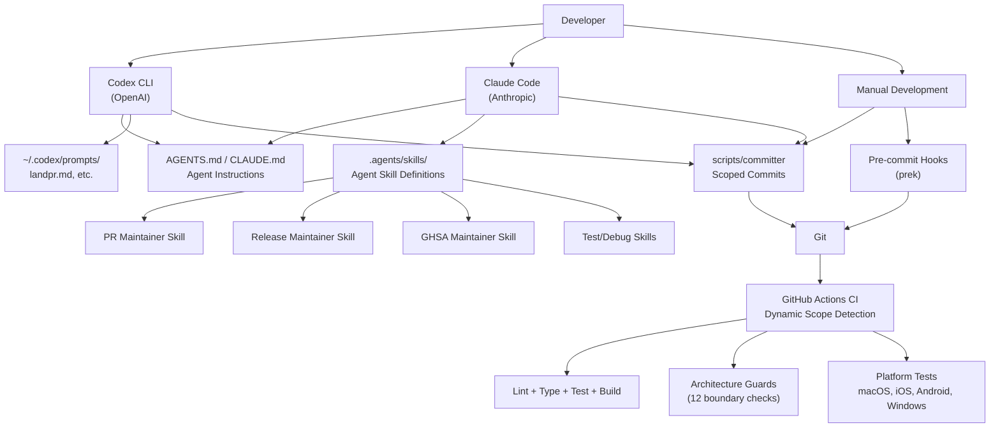
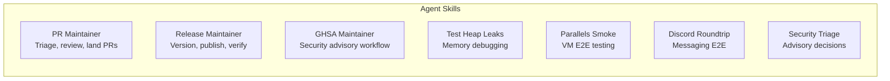
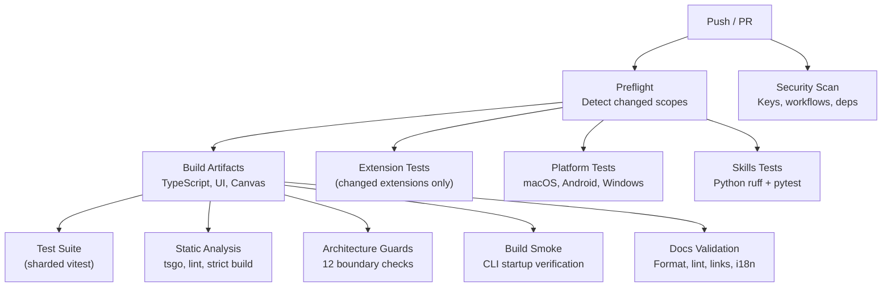
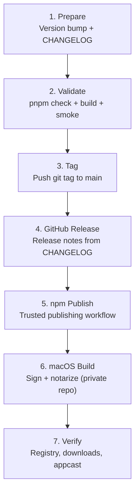
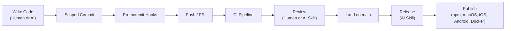

# Development Process

OpenClaw is developed with significant **self-dogfooding** — AI coding agents are an
integral part of the development workflow. The repo is set up for **dual-agent
development** using both **OpenAI Codex CLI** and **Claude Code**, with Codex appearing
to be the primary tool for PR review and landing workflows, and Claude Code used
alongside it for development tasks. The repo ships with custom agent skills, instruction
files for both tools (`CLAUDE.md`/`AGENTS.md`), and automation that treats AI-assisted
development as a first-class concern.

In addition to self-dogfooding, the core agent runtime is powered by an external library
(`@mariozechner/pi-coding-agent`), which provides the inference loop and session
management that OpenClaw orchestrates.

## Development Ecosystem Overview



---

## Self-Dogfooding: Dual-Agent Development

### Two AI Coding Agents

The development workflow uses both major AI coding agents:

| Tool | Primary use | Config location |
|---|---|---|
| **Codex CLI** (OpenAI) | PR review (`codex review`), PR landing (`/landpr`), parallel batch work | `~/.codex/prompts/`, `~/.codex/config.toml` |
| **Claude Code** (Anthropic) | Development tasks, agent skills, codebase exploration | `CLAUDE.md`, `.agents/skills/` |

CONTRIBUTING.md explicitly states: *"run `codex review --base origin/main` locally
before opening your PR. Treat this as the current highest standard of AI review."*

A cost tracking tool (`codexbar`) monitors usage and spend across both providers by
reading session logs from `~/.codex/sessions/` and `~/.claude/projects/`.

### CLAUDE.md / AGENTS.md — The Agent Constitution

The repo's `CLAUDE.md` (269 lines, symlinked from `AGENTS.md`) serves as the canonical
instruction set for any AI agent working in the codebase. Both Claude Code and Codex
read it. It defines:

| Section | What it governs |
|---|---|
| **Project structure** | Module organization, naming conventions, import boundaries |
| **Build commands** | `pnpm check`, `pnpm test`, `pnpm build` — what to run when |
| **Coding style** | TypeScript conventions, no `any`, no `@ts-nocheck`, Oxlint/Oxfmt |
| **Testing rules** | Vitest, `forks` pool only, coverage thresholds, cleanup requirements |
| **Commit rules** | Use `scripts/committer`, scoped staging, message style |
| **Safety guardrails** | No secrets in code, no `node_modules` edits, no force-push, multi-agent coordination |
| **Verification gates** | Local dev gate vs. landing gate vs. CI gate |

This file is effectively a "constitution" — it ensures that whether a human or an AI
agent makes a change, the same standards apply.

### Agent Skills

**Location:** `.agents/skills/`

OpenClaw defines specialized AI agent skills for recurring development workflows:



**PR Maintainer** — The most heavily used skill. Codifies the full PR lifecycle: triage,
review with bug-fix evidence gates (symptom + root cause + regression test), auto-close
labels, and the landing workflow.

**Release Maintainer** — Orchestrates multi-platform releases: version coordination
across 11 locations, changelog assembly, npm publish via trusted publishing, macOS
signing/notarization handoff, and post-publish verification.

**GHSA Maintainer** — Security advisory management: inspection, private fork validation,
GHSA API payload assembly, and publish sequencing.

**Other skills** — Test heap leak debugging, VM-based E2E testing across macOS/Windows/Linux,
Discord roundtrip verification, and security triage.

### How Self-Dogfooding Works in Practice

The development loop:

1. A developer (or Claude Code) makes changes
2. `scripts/committer` scopes the commit to touched files only
3. Pre-commit hooks (`prek`) run lint, format, security checks
4. On PR creation, the PR Maintainer skill can triage and review
5. CI runs dynamic scope detection and parallel verification
6. On merge, the Release Maintainer skill handles version bumps and publishing

The AI agents and human developers share the same tooling, verification gates, and
commit workflow. The `coding-agent` skill (`skills/coding-agent/SKILL.md`) even defines
patterns for spawning multiple Codex processes in parallel for batch work like reviewing
multiple PRs simultaneously.

---

## Development Workflow

### Local Development Loop

```bash
pnpm install          # Install dependencies
prek install          # Install pre-commit hooks

# Edit code, then:
pnpm check            # Local dev gate (TypeScript + lint)
pnpm test -- path/to/file.test.ts   # Scoped tests

# Before landing on main:
pnpm build            # Required if touching build output / module boundaries
pnpm test             # Full test suite
```

### Commit Management

Commits are made through `scripts/committer`:

```bash
scripts/committer "CLI: add verbose flag to send" src/commands/send.ts src/commands/send.test.ts
```

This prevents accidental staging, blocks `node_modules`, handles git lock retries, and
validates commit messages. Fast-commit mode (`FAST_COMMIT=1`) skips the hook's repo-wide
checks for intermediate commits.

### Pre-commit Hooks

| Check | Tool |
|---|---|
| Trailing whitespace, EOF fixer | pre-commit built-in |
| Secret detection | detect-secrets |
| GitHub Actions lint | actionlint + zizmor |
| Dependency audit | pnpm audit --prod |
| TypeScript/JS lint + format | Oxlint + Oxfmt |
| Swift lint + format | swiftlint + swiftformat |
| Python lint + tests | ruff + pytest |

---

## CI/CD Pipeline

### Dynamic Scope Detection

The CI uses a **preflight job** that detects what changed and routes work to only the
relevant lanes:



### CI Lanes

| Lane | What it checks |
|---|---|
| **Security-Fast** | Private keys, workflow audit, dependency audit |
| **Build Artifacts** | TypeScript build, UI build, Canvas bundle |
| **Test Suite** | `pnpm test` (vitest, sharded across workers) |
| **Static Analysis** | `pnpm tsgo` (types), `pnpm lint`, strict build |
| **Architecture Guards** | 12 boundary checks (import boundaries, no cross-extension imports, etc.) |
| **Build Smoke** | `node openclaw.mjs --help`, plugin load verification |
| **Docs Validation** | Format, lint, i18n glossary, broken links |
| **Extension Tests** | Per-extension targeted tests (changed only) |
| **Platform Tests** | macOS (Swift), Android (Kotlin), Windows |
| **Skills Tests** | Python ruff + pytest |

---

## Testing Strategy

- **Vitest** with V8 coverage (70% threshold)
- **Pool:** `forks` only (process isolation)
- **Suites:** Unit, contracts, extensions, channels, live (real API keys), Docker E2E, build smoke
- **Memory management:** Heap snapshots, RSS tracing, sharding, conservative serial mode

---

## Release Process



### Release Channels

| Channel | Tag format | npm dist-tag |
|---|---|---|
| **Stable** | `vYYYY.M.D` | `latest` |
| **Beta** | `vYYYY.M.D-beta.N` | `beta` |
| **Correction** | `vYYYY.M.D-N` | `latest` |

Version bumps touch 11 locations (npm, macOS, iOS, Android, docs). npm uses GitHub
trusted publishing. macOS signing/notarization happens in a private repo.

---

## Multi-Platform Build

| Platform | Technology | Distribution |
|---|---|---|
| **npm** | TypeScript via tsdown | npmjs.com |
| **macOS** | SwiftUI menubar app | DMG (Sparkle updates) |
| **iOS** | SwiftUI | TestFlight |
| **Android** | Kotlin + Jetpack Compose | Google Play Store |
| **Docker** | Multi-platform (amd64 + arm64) | ghcr.io |

---

## Summary



The defining characteristic is that **AI agents and human developers share the same
workflow** — same `scripts/committer`, same hooks, same CI gates, same review standards.
`CLAUDE.md`/`AGENTS.md` ensures consistency across both Codex and Claude Code. Agent
skills automate the repetitive parts while keeping humans in the loop for
approval-gated actions.
