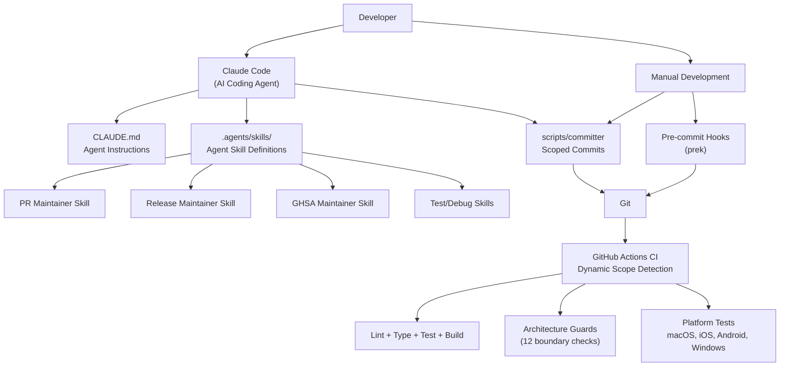
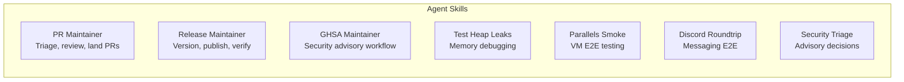
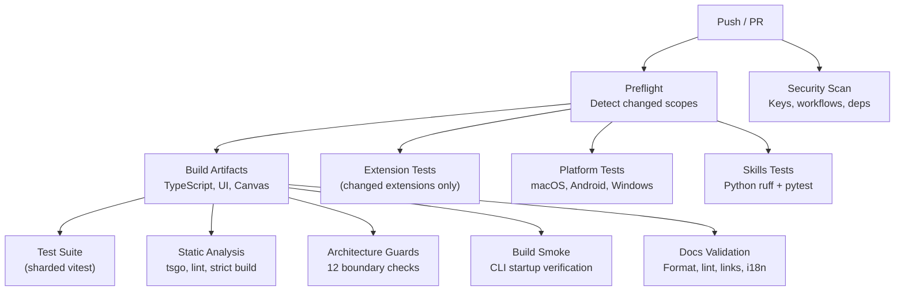
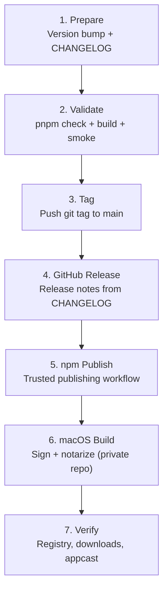
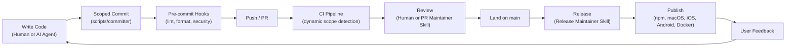

# Development Process

OpenClaw is developed with significant **self-dogfooding** — AI agents (specifically
Claude Code) are an integral part of the development workflow. The repo ships with custom
agent skills, an agent-targeted instruction file (`CLAUDE.md`), and automation that
treats AI-assisted development as a first-class concern.

In addition to self-dogfooding, the core agent runtime is powered by an external library
(`@mariozechner/pi-coding-agent`), which provides the inference loop and session
management that OpenClaw orchestrates.

## Development Ecosystem Overview



---

## Self-Dogfooding: AI-Assisted Development

### CLAUDE.md — The Agent Constitution

The repo's `CLAUDE.md` (269 lines) serves as the canonical instruction set for any AI
agent working in the codebase. It is automatically loaded by Claude Code and defines:

| Section | What it governs |
|---|---|
| **Project structure** | Module organization, naming conventions, import boundaries |
| **Build commands** | `pnpm check`, `pnpm test`, `pnpm build` — what to run when |
| **Coding style** | TypeScript conventions, no `any`, no `@ts-nocheck`, Oxlint/Oxfmt |
| **Testing rules** | Vitest, `forks` pool only, coverage thresholds, cleanup requirements |
| **Commit rules** | Use `scripts/committer`, scoped staging, message style |
| **Safety guardrails** | No secrets in code, no `node_modules` edits, no force-push, multi-agent coordination |
| **Verification gates** | Local dev gate vs. landing gate vs. CI gate |

This file is effectively a "constitution" — it ensures that whether a human or an AI
agent makes a change, the same standards apply.

### Agent Skills

**Location:** `.agents/skills/`

OpenClaw defines specialized AI agent skills for recurring development workflows. These
are not user-facing features — they are tools for the development team.



#### PR Maintainer (`openclaw-pr-maintainer`)

The most heavily used skill. It codifies the full PR lifecycle:

- **Triage:** Read the PR, understand scope, check for related issues
- **Review decision flow:** Apply bug-fix evidence gates (symptom + root cause + fix verification + regression test)
- **Auto-close labels:** `r:skill`, `r:support`, `r:no-ci-pr`, `r:too-many-prs`, `r:spam`, `invalid`, `dirty`
- **Landing workflow:** Rebase, verify CI, merge — following the `/landpr` process
- **Safety:** Bulk close/reopen requires explicit confirmation for >5 PRs

#### Release Maintainer (`openclaw-release-maintainer`)

Orchestrates the multi-platform release process:

- Version coordination across 11 locations (npm, macOS, iOS, Android, docs)
- Changelog assembly from `CHANGELOG.md`
- Release validation (`pnpm check`, `pnpm build`, smoke tests)
- npm publish via GitHub trusted publishing
- macOS signing/notarization handoff to private release repo
- Post-publish verification

#### GHSA Maintainer (`openclaw-ghsa-maintainer`)

Security advisory management:

- Advisory inspection and severity assessment
- Private fork validation (no open PRs before publish)
- GHSA API payload assembly
- Publish sequencing (separate PATCH calls for severity + CVSS)

#### Other Skills

- **Test Heap Leaks** — Heap snapshot collection, RSS tracing, per-file memory analysis
- **Parallels Smoke** — VM-based E2E testing across macOS, Windows, Linux guests
- **Discord Roundtrip** — Guest send, host verify, host reply, guest readback workflow
- **Security Triage** — High-confidence close/keep decisions for incoming advisories

### How Self-Dogfooding Works in Practice

The development loop looks like this:

1. A developer (or Claude Code) makes changes
2. `scripts/committer` scopes the commit to touched files only
3. Pre-commit hooks (`prek`) run lint, format, security checks
4. On PR creation, the PR Maintainer skill can triage and review
5. CI runs dynamic scope detection and parallel verification
6. On merge to main, the Release Maintainer skill handles version bumps and publishing

The AI agent and human developers share the same tooling, the same verification gates,
and the same commit workflow. The `CLAUDE.md` file ensures the AI follows the same rules.

---

## Development Workflow

### Local Development Loop

```bash
pnpm install          # Install dependencies
prek install          # Install pre-commit hooks

# Edit code, then:
pnpm check            # Local dev gate (TypeScript + lint)
pnpm test -- path/to/file.test.ts   # Scoped tests

# Before landing on main:
pnpm build            # Required if touching build output / module boundaries
pnpm test             # Full test suite
```

### Commit Management

Commits are made through a dedicated helper:

```bash
scripts/committer "CLI: add verbose flag to send" src/commands/send.ts src/commands/send.test.ts
```

`scripts/committer` is used instead of raw `git add`/`git commit` because:
- It scopes staging to the listed files (prevents accidental inclusion)
- It blocks `node_modules` from being staged
- It handles git lock retries
- It validates the commit message is not empty

**Fast-commit mode:** When main is moving fast, `FAST_COMMIT=1 git commit ...` skips the
hook's repo-wide format and check (manual verification of the touched surface is still
required).

### Pre-commit Hooks

Installed via `prek`, the hooks run:

| Check | Tool |
|---|---|
| Trailing whitespace, EOF fixer | pre-commit built-in |
| Merge conflict markers | pre-commit built-in |
| Secret detection | detect-secrets |
| GitHub Actions lint | actionlint + zizmor |
| Dependency audit | pnpm audit --prod |
| TypeScript/JS lint + format | Oxlint + Oxfmt |
| Swift lint + format | swiftlint + swiftformat |
| Python lint | ruff |
| Python tests | pytest |

---

## CI/CD Pipeline

### Architecture: Dynamic Scope Detection

The CI pipeline uses a **preflight job** that detects what changed and routes work to
only the relevant lanes. This prevents a docs-only change from running the full test
suite.



### CI Lanes

| Lane | What it checks | Trigger |
|---|---|---|
| **Security-Fast** | Private keys, workflow audit, dependency audit | Always |
| **Build Artifacts** | TypeScript build, UI build, Canvas bundle | Always |
| **Test Suite** | `pnpm test` (vitest, sharded across workers) | Source changes |
| **Static Analysis** | `pnpm tsgo` (types), `pnpm lint`, strict build | Source changes |
| **Architecture Guards** | 12 specialized boundary checks (no cross-extension imports, no raw channel fetch, etc.) | Source changes |
| **Build Smoke** | `node openclaw.mjs --help`, `pnpm test:build:singleton` | Source changes |
| **Docs Validation** | Format, lint, i18n glossary, broken links | Doc changes |
| **Extension Tests** | Per-extension targeted tests | Extension changes only |
| **Platform: macOS** | Swift lint, node tests | macOS code changes |
| **Platform: Android** | Kotlin lint, Gradle tests | Android code changes |
| **Platform: Windows** | vitest with conservative settings | Source changes |
| **Skills** | ruff + pytest | Python skill changes |

### Architecture Guards (check-additional)

These 12 guards enforce structural invariants that are intentionally kept out of the
local dev loop (to keep `pnpm check` fast):

- Plugin/extension import boundary enforcement
- No cross-extension imports
- No direct `src/plugin-sdk/` imports from extensions
- Gateway watch regression detection
- Web search provider boundaries
- Ingress owner context validation
- And 6 more specialized guards

---

## Testing Strategy

### Framework

- **Vitest** with V8 coverage provider
- **Pool:** `forks` only (process isolation; threads/vmThreads explicitly banned)
- **Coverage thresholds:** 70% lines, branches, functions, statements
- **Test naming:** `*.test.ts` colocated with source; `*.e2e.test.ts` for end-to-end

### Test Suites

| Suite | Command | Scope |
|---|---|---|
| **Unit** | `pnpm test` | `src/**/*.test.ts` |
| **Contracts** | `pnpm test:contracts` | Channel + SDK contract verification |
| **Extensions** | `pnpm test:extensions` | Per-extension isolated tests |
| **Channels** | `pnpm test:channels` | Channel-specific tests (single worker) |
| **Live** | `OPENCLAW_LIVE_TEST=1 pnpm test:live` | Real API keys, real inference |
| **Docker E2E** | `pnpm test:docker:*` | Onboarding, gateway, plugins, MCP, QR |
| **Build smoke** | `pnpm test:build:singleton` | Verify bundled plugins load |

### Memory and Performance

Tests are carefully managed for memory:
- `OPENCLAW_TEST_MAX_OLD_SPACE_SIZE_MB=6144` in CI
- Heap snapshot collection for leak detection
- Per-file RSS tracing
- Sharding support for parallel execution
- Conservative serial mode for debugging: `OPENCLAW_TEST_PROFILE=serial`

---

## Release Process

### Release Channels

| Channel | Tag format | npm dist-tag | Example |
|---|---|---|---|
| **Stable** | `vYYYY.M.D` | `latest` | `v2026.3.27` |
| **Beta** | `vYYYY.M.D-beta.N` | `beta` | `v2026.3.27-beta.1` |
| **Correction** | `vYYYY.M.D-N` | `latest` | `v2026.3.27-1` |

### Version Locations (11 total)

A version bump touches all of these:

1. `package.json` (npm CLI)
2. `apps/android/app/build.gradle.kts` (versionName + versionCode)
3. `apps/ios/Sources/Info.plist` (CFBundleShortVersionString + CFBundleVersion)
4. `apps/ios/Tests/Info.plist`
5. `apps/macos/Sources/OpenClaw/Resources/Info.plist`
6. `docs/install/updating.md` (pinned version in docs)
7. `CHANGELOG.md` (active version block)
8. Peekaboo Xcode projects (if applicable)

The `appcast.xml` (macOS Sparkle feed) is updated separately, only after the macOS build
is published.

### Release Flow



**Key details:**

- **npm publishing** uses GitHub trusted publishing (no NPM_TOKEN), gated by
  `@openclaw/openclaw-release-managers` approval
- **macOS build** happens in a private repo (`openclaw/releases-private`) because it
  requires signing and notarization credentials
- **Verification** includes checking the npm registry, GitHub release assets (.zip, .dmg,
  .dSYM.zip), and the Sparkle appcast feed

---

## Multi-Platform Build

### npm Package (primary)

```bash
pnpm build    # TypeScript → dist/ (ESM)
```

The build pipeline:
1. Canvas A2UI bundle generation
2. TypeScript compilation via tsdown
3. Post-build runtime patching
4. Build stamp (version + git info)
5. Plugin SDK type definitions (tsc)
6. Asset copying (canvas, hooks, templates)
7. Metadata generation (build info, CLI startup, compat)

### macOS App (`apps/macos/`)

SwiftUI menubar application. The gateway runs inside this app.

- **Dev build:** `scripts/package-mac-app.sh`
- **Release:** `scripts/package-mac-dist.sh` (build + sign + notarize + DMG)
- Code signing and notarization handled by dedicated scripts

### iOS App (`apps/ios/`)

SwiftUI companion app, distributed via TestFlight.

- **Build:** xcodegen + Xcode
- **Release:** `scripts/ios-beta-archive.sh` + `ios-beta-release.sh`

### Android App (`apps/android/`)

Kotlin + Jetpack Compose.

- **Build:** Gradle (`scripts/android-assemble.sh`)
- **Flavors:** `play` (store) and `thirdParty` (with SMS/call log)
- **Release:** Google Play Store via `scripts/android-bundle-release.sh`

### Docker Images

Multi-platform (amd64 + arm64v8), published to `ghcr.io/openclaw/openclaw`.

- **Variants:** `default` and `slim`
- **Tags:** Version-tagged + `main-{arch}` rolling tags
- **Publishing:** Automatic on git tag push, gated by `docker-release` environment

---

## Summary: The Development Feedback Loop



The defining characteristic of OpenClaw's development process is that **AI agents and
human developers share the same workflow.** The same `scripts/committer`, the same
pre-commit hooks, the same CI gates, the same review standards. `CLAUDE.md` ensures
consistency. The agent skills automate the repetitive parts (PR triage, release
orchestration, security advisory handling) while keeping humans in the loop for
approval-gated actions (publishing, force operations, bulk changes).
