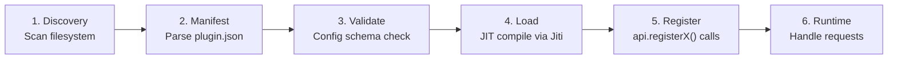

# Plugin System

OpenClaw's plugin system is the primary extensibility mechanism. Channels, LLM providers,
tools, speech synthesis, image generation, web search, memory engines, and more are all
implemented as plugins. The core runtime is an orchestrator; nearly all user-facing
capabilities come from plugins.

The system currently ships with **82+ bundled extensions** and supports third-party
plugin installation.

## Plugin Lifecycle



### Phase 1 — Discovery

**Location:** `src/plugins/discovery.ts`

OpenClaw scans multiple locations for plugin candidates:

| Source | Location | Use case |
|---|---|---|
| **Bundled** | `extensions/` | Built-in plugins shipped with OpenClaw |
| **Global** | `~/.openclaw/plugins/` | User-installed plugins (all projects) |
| **Workspace** | `./plugins/` | Project-specific plugins |
| **Config** | `plugins.installs` in config | External npm packages |

Discovery applies security checks: path validation, ownership verification, and
world-writable path rejection.

Results are cached for 1000ms to collapse bursty filesystem reads during startup.

### Phase 2 — Manifest Loading

**Location:** `src/plugins/manifest.ts`

Each plugin directory must contain an `openclaw.plugin.json` — a static metadata file
that can be parsed without executing any plugin code:

```json
{
  "id": "discord",
  "channels": ["discord"],
  "enabledByDefault": true,
  "configSchema": { "type": "object" },
  "providerAuthEnvVars": {
    "discord": ["DISCORD_BOT_TOKEN"]
  },
  "contracts": {
    "speechProviders": ["elevenlabs"],
    "mediaUnderstandingProviders": ["anthropic-vision"]
  }
}
```

The manifest provides enough information for:
- Auth choice routing (which env vars enable which providers)
- Configuration validation
- Feature discovery (which channels, providers, tools a plugin offers)

All without loading plugin runtime code. This keeps startup fast.

### Phase 3 — Config Validation

Plugin configuration is validated against the schema declared in the manifest or the
plugin's runtime `configSchema`. This catches misconfigurations before any plugin code
runs.

Schemas can be:
- JSON Schema objects (from manifest)
- Zod schemas (from runtime, via `safeParse`)
- Custom validators (via `validate()` function)

### Phase 4 — Module Loading

**Location:** `src/plugins/loader.ts`

Plugin TypeScript is compiled just-in-time using **Jiti** (JIT TypeScript imports). Each
plugin gets:

- **Isolated module scope** — plugins cannot accidentally share global state
- **SDK alias resolution** — `openclaw/plugin-sdk/*` imports are mapped to the correct
  internal paths, decoupling plugins from the repo's file structure
- **Lazy loading** — plugin code is not loaded until the plugin is actually needed

### Phase 5 — Registration

When a plugin's `register()` function is called, it receives an `OpenClawPluginApi`
object and uses it to declare its capabilities:

```typescript
export default definePluginEntry({
  id: "my-plugin",
  register(api: OpenClawPluginApi) {
    api.registerProvider(myProvider);
    api.registerTool(myTool);
    api.registerHook(["llm_output"], myHook);
  }
});
```

All registrations are collected into a **plugin registry** (`registry.ts`) that the
gateway and agent runtime query at request time.

Registration has three modes:

| Mode | When used | What loads |
|---|---|---|
| `full` | Gateway runtime | All capabilities |
| `setup-only` | Configuration/onboarding | Only setup wizard and manifest metadata |
| `setup-runtime` | Pre-listen startup | Setup + a subset of runtime for initialization |

The two-phase channel pattern (`setup-only` vs. `full`) is an optimization: inactive
channels load only their config UI, not their full messaging runtime.

### Phase 6 — Runtime

Once registered, plugin code executes on demand:
- Channel plugins receive inbound messages and send outbound responses
- Provider plugins handle LLM inference requests
- Tool plugins execute when the agent calls their tools
- Hook plugins fire on lifecycle events

---

## Extension Points

Everything in OpenClaw that faces the user — channels, AI models, tools — is registered
through one of these extension points:

```mermaid
graph TD
    API["OpenClawPluginApi"] --> Channels["registerChannel()"]
    API --> Providers["registerProvider()"]
    API --> Tools["registerTool()"]
    API --> Hooks["registerHook()"]
    API --> Speech["registerSpeechProvider()"]
    API --> Media["registerMediaUnderstandingProvider()"]
    API --> ImgGen["registerImageGenerationProvider()"]
    API --> Search["registerWebSearchProvider()"]
    API --> Cmds["registerCommand()"]
    API --> HTTP["registerHttpRoute()"]
    API --> Svc["registerService()"]
    API --> CLI["registerCli()"]
    API --> Ctx["registerContextEngine()"]
    API --> Mem["registerMemory*()"]
    API --> Inter["registerInteractiveHandler()"]
```



### Extension Point Catalog

#### Channels

Add a messaging platform integration. A channel plugin implements:
- **Inbound:** Parse platform-specific messages into a normalized envelope
- **Outbound:** Format and send responses back to the platform
- **Setup:** Interactive onboarding wizard for credentials/configuration
- **Security:** DM allowlists, group permissions
- **Threading:** Reply mode, thread support
- **Pairing:** Device approval notifications

Examples: Discord, Slack, Telegram, Matrix, iMessage, Signal, WhatsApp, MS Teams, Zalo,
voice-call.

#### Providers

Add an LLM inference backend. A provider plugin implements:
- **Auth:** API key, OAuth, or synthetic auth for local models
- **Model catalog:** Available models with capabilities (vision, tools, context window)
- **Stream function:** The `StreamFn` that handles actual inference
- **Model resolution:** Dynamic model ID normalization and fallback

Examples: Anthropic, OpenAI, Google, Ollama, OpenRouter, Together AI, xAI, Deepseek.

#### Tools

Add agent-callable functions. Tools are defined with a name, description, JSON Schema
parameters, and an execute function. The agent can call them during inference and receive
results.

Tools can be static definitions or **factories** that receive session context to
dynamically configure themselves.

#### Hooks

React to lifecycle events in the message pipeline. Available hook points:

| Hook | Fires when |
|---|---|
| `before_model_resolve` | Before selecting which model to use |
| `before_prompt_build` | Before assembling the system prompt |
| `before_agent_start` | Before the agent subprocess starts |
| `llm_input` | Before sending messages to the model |
| `llm_output` | After receiving model response |
| `agent_end` | After agent finishes processing |
| `before_compaction` / `after_compaction` | Around transcript compaction |
| `message_received` / `message_sending` / `message_sent` | Message pipeline stages |
| `inbound_claim` | Claim an inbound message before agent routing |
| `before_reset` | Before session reset |

Multiple plugins can register the same hook (ordered by priority).

#### Speech Providers

Text-to-speech and speech-to-text capabilities. Implement `synthesize()` for TTS and
optionally `listVoices()` for voice enumeration.

#### Media Understanding Providers

Image, audio, and video analysis. Register a `understand()` function that takes media
input and returns structured analysis.

#### Image Generation Providers

Text-to-image capabilities. Register `generate()` and `validateParams()` functions.

#### Web Search Providers

Search engine integration. Register a `createTool()` factory that returns a
search-capable tool.

#### Commands

Direct command handlers that bypass the LLM entirely. Useful for quick actions like
status checks or configuration changes.

#### HTTP Routes

Custom HTTP endpoints on the gateway server. Useful for webhooks, health checks, or
custom APIs.

#### Services

Long-running background processes with `start()` / `stop()` lifecycle methods.

#### CLI Commands

Custom subcommands added to the `openclaw` CLI.

#### Context Engines and Memory

Memory and context management: embedding providers, prompt sections, flush plans, and
runtime adapters for persistent memory.

---

## SDK Surface

**Location:** `src/plugin-sdk/` (323 files)

The plugin SDK is the public contract between OpenClaw core and extension code.
Extensions import from `openclaw/plugin-sdk/*` subpaths — they never import core `src/`
directly.

### OpenClawPluginApi

The main interface passed to every plugin's `register()` function:

```typescript
type OpenClawPluginApi = {
  // Identity
  id: string;
  name: string;
  version?: string;
  source: string;
  registrationMode: "full" | "setup-only" | "setup-runtime";

  // Configuration
  config: OpenClawConfig;
  pluginConfig?: Record<string, unknown>;

  // Runtime access (trusted surface)
  runtime: PluginRuntime;

  // Logging
  logger: PluginLogger;

  // Registration methods (all extension points above)
  registerChannel: (...) => void;
  registerProvider: (...) => void;
  registerTool: (...) => void;
  registerHook: (...) => void;
  // ... and all others listed in the extension points catalog
};
```

### PluginRuntime

Trusted in-process access to core services (available to bundled plugins):

| Surface | Capabilities |
|---|---|
| `runtime.subagent` | Spawn subagent runs, wait for results, manage sessions |
| `runtime.channel` | Resolve accounts, resolve targets, send messages |
| `runtime.state` | Access plugin state directory paths |
| `runtime.media` | Media handling utilities |
| `runtime.tts` / `runtime.stt` | Speech synthesis and recognition |
| `runtime.events` | Event emission |
| `runtime.modelAuth` | Model auth resolution |

### Entry Helpers

The SDK provides three entry helpers for defining plugins:

```typescript
// General plugin (providers, tools, services, etc.)
definePluginEntry({ id, name, register(api) { ... } });

// Channel plugin (two-phase: setup + full runtime)
defineChannelPluginEntry({ id, plugin, setRuntime, registerFull });

// Setup-only entry (lightweight, config/onboarding only)
defineSetupPluginEntry(setupPlugin);
```

---

## Example Extension Structure

A typical channel plugin (using Discord as the example):

```
extensions/discord/
  package.json              # npm metadata + openclaw field
  openclaw.plugin.json      # Static manifest
  index.ts                  # Full runtime entry (defineChannelPluginEntry)
  setup-entry.ts            # Lightweight setup-only entry
  src/
    channel.ts              # ChannelPlugin implementation
    channel.setup.ts        # Setup-only variant
    runtime.ts              # Runtime state storage
    subagent-hooks.ts       # Hook registration
```

The `package.json` `openclaw` field declares:

```json
{
  "openclaw": {
    "extensions": ["./index.ts"],
    "setupEntry": "./setup-entry.ts",
    "channel": {
      "id": "discord",
      "label": "Discord",
      "docsPath": "/channels/discord"
    },
    "install": {
      "npmSpec": "@openclaw/discord",
      "minHostVersion": ">=2026.3.27"
    }
  }
}
```

The `index.ts` wires everything together:

```typescript
import { defineChannelPluginEntry } from "openclaw/plugin-sdk/core";
import { discordPlugin } from "./src/channel.js";
import { setDiscordRuntime } from "./src/runtime.js";
import { registerDiscordSubagentHooks } from "./src/subagent-hooks.js";

export default defineChannelPluginEntry({
  id: "discord",
  name: "Discord",
  plugin: discordPlugin,
  setRuntime: setDiscordRuntime,
  registerFull: registerDiscordSubagentHooks,
});
```

---

## Isolation and Security

| Mechanism | Purpose |
|---|---|
| **Module scope** | Each plugin loaded in isolated Jiti context — no shared mutable globals |
| **SDK aliases** | Imports resolve through aliases, preventing path coupling to core internals |
| **Path validation** | Escape detection prevents plugins from accessing files outside their scope |
| **Ownership checks** | World-writable plugin directories are rejected |
| **Capability registration** | Plugins declare what they do; core enforces boundaries |
| **Import boundaries** | Extension code must use `openclaw/plugin-sdk/*` — no direct `src/` imports |

Bundled plugins (in `extensions/`) have access to the full `PluginRuntime`. Third-party
plugins interact only through the public SDK surface.

### Performance Optimizations

| Optimization | Benefit |
|---|---|
| **Discovery cache** (1000ms TTL) | Collapses bursty filesystem reads at startup |
| **Registry LRU cache** (128 entries) | Reuses compiled registries across requests |
| **Manifest pre-load** | Metadata available without loading plugin code |
| **Two-mode channels** | Inactive channels load only their setup code |
| **Lazy runtime** | Only the subsystems a plugin uses are loaded |
| **Static metadata** | Auth choices, env vars, and capabilities available without runtime |
