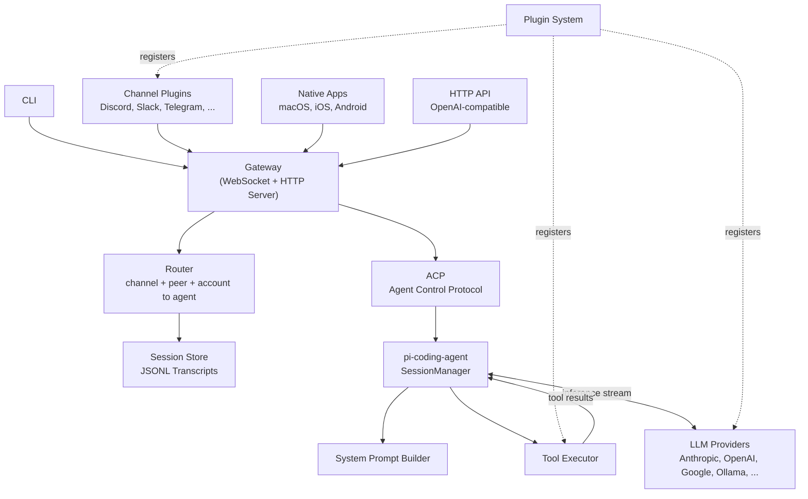
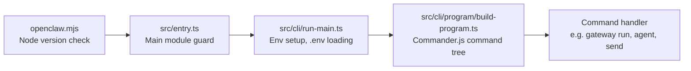
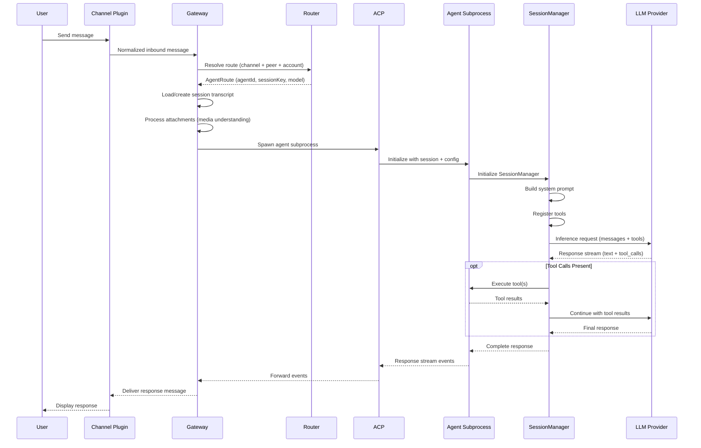
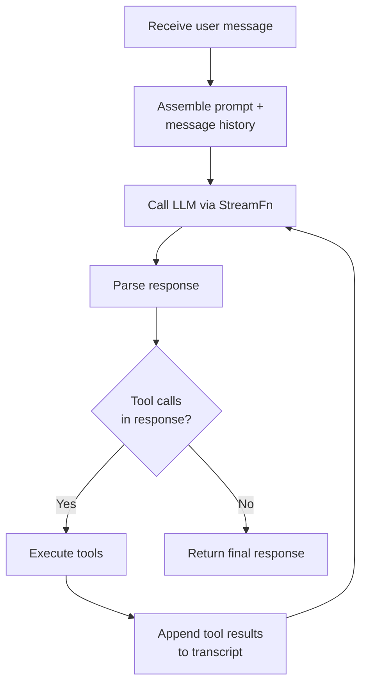
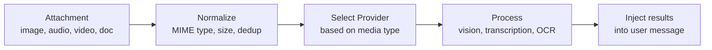

# System Architecture

OpenClaw's architecture centers on a **gateway** — a locally-running WebSocket and HTTP
server that receives messages from any connected channel, routes them to the appropriate
**agent**, invokes an LLM via a **provider**, executes **tools** as needed, and delivers
the response back through the originating channel.

The agent execution itself is delegated to
[`pi-coding-agent`](https://github.com/mariozechner/pi-coding-agent), an external agent
SDK that manages the inference loop (prompt, model, tool calls, loop). OpenClaw wraps
this engine with multi-channel routing, a plugin system, session persistence, media
processing, and native platform clients.

## High-Level Component Map



The six major architectural blocks:

| Block | Role | Key modules |
|---|---|---|
| **Gateway** | Central message hub, WebSocket/HTTP server, session orchestration | `src/gateway/` |
| **Router** | Maps inbound messages to agents based on channel, peer, and account | `src/routing/` |
| **Agent Runtime** | Executes agent logic in isolated subprocesses via ACP | `src/agents/`, `src/acp/` |
| **Provider Layer** | Abstracts LLM providers behind a uniform streaming interface | `extensions/anthropic/`, `extensions/openai/`, etc. |
| **Plugin System** | Discovers, loads, and registers extension packages | `src/plugins/`, `src/plugin-sdk/` |
| **Session Store** | Persists conversation transcripts and session metadata | `src/config/sessions/`, `src/sessions/` |

### Architectural Principles

1. **Local-first.** The gateway runs on the user's machine, not in the cloud. Credentials and conversation history stay local.
2. **Everything is a plugin.** Channels, LLM providers, tools, speech, image generation, and web search are all registered through the plugin system. The core is an orchestrator.
3. **Subprocess isolation.** Agents run in separate Node.js processes via ACP, providing crash isolation and clean resource boundaries.
4. **External agent engine.** OpenClaw does not implement its own inference loop. It delegates to `pi-coding-agent`'s `SessionManager`, which handles the prompt-model-tool cycle.
5. **Multi-agent routing.** Different agents (with different models, tools, and system prompts) can serve different channels or peers simultaneously.

---

## Boot Sequence

When the user runs `openclaw`, the system bootstraps through a chain of lazy-loading
entry points:



**`openclaw.mjs`** — Bash/Node polyglot shim. Validates Node 22.12+ and loads `dist/entry.js`.

**`src/entry.ts`** — Guards against being loaded as a library (vs. main module). Normalizes argv, applies profiles, handles version/help fast paths, and lazy-imports the CLI.

**`src/cli/run-main.ts`** — Loads `.env` files (project + state directory), normalizes the environment, and either routes to a fast-path handler (version, help) or falls through to the full CLI program.

**`src/cli/program/build-program.ts`** — Builds the Commander.js command tree. Core commands are registered eagerly; subcli commands (gateway, plugins, devices, etc.) are registered lazily. Plugin CLI commands are appended via `registerPluginCliCommands()`.

The lazy loading strategy is deliberate: `openclaw --help` resolves in milliseconds because it never loads the gateway, agent runtime, or plugin system.

---

## The Gateway

**Location:** `src/gateway/` (297 files)

The gateway is the central nervous system. It is a combined WebSocket and HTTP server
that all clients connect to — CLI, channel plugins, native apps, and third-party
integrations.

### Key Responsibilities

| Responsibility | Implementation |
|---|---|
| **WebSocket RPC** | Bidirectional messaging with clients. Methods like `chat.send`, `agent.wait`, `sessions.list`. |
| **HTTP API** | OpenAI-compatible `/v1/chat/completions` and `/v1/models` endpoints. Allows any OpenAI client to use OpenClaw-hosted models. |
| **Session orchestration** | Manages session lifecycle, parent-child hierarchies (subagents), and concurrent session limits. |
| **Agent invocation** | Spawns agent subprocesses via ACP when a message needs processing. |
| **Event broadcasting** | Streams agent events (tokens, tool calls, status changes) to connected clients in real time. |
| **Channel health** | Monitors channel connection status (`channel-health-monitor.ts`). |
| **Authentication** | Validates WebSocket connections and HTTP requests (`auth.ts`). |

### Gateway Boot

When `openclaw gateway run` is invoked:

1. Load and validate configuration (`src/config/`)
2. Initialize session store
3. Discover and register plugins (channels, providers, tools)
4. Start WebSocket server on configured port
5. Start HTTP server (OpenAI-compatible API)
6. Activate channel plugins (connect to Discord, Telegram, etc.)
7. Begin health monitoring

The gateway runs as a menubar app on macOS (not a separate LaunchAgent). On other
platforms it runs as a foreground or daemon process.

---

## Message Routing

**Location:** `src/routing/` (13 files)

When a message arrives at the gateway, the router determines which agent should handle
it based on three dimensions:

| Dimension | Example |
|---|---|
| **Channel** | `discord`, `telegram`, `cli` |
| **Peer** | A specific Discord user ID, phone number, or guild |
| **Account** | Which of the user's configured accounts received the message |

### Routing Resolution

`resolve-route.ts` evaluates binding rules (configured in YAML) to produce a
`ResolvedAgentRoute`:

```
{agentId, sessionKey, model, tools, ...}
```

The **session key** encodes the triple of `(agent, account, peer)` and determines which
conversation transcript to use. This means the same agent talking to two different
Discord users maintains separate conversation histories.

Multi-agent setups are first-class: you can bind one agent to your work Slack and a
different agent (with different model, tools, and personality) to your personal Telegram.

---

## Message Processing Pipeline

This is the end-to-end flow from user input to delivered response — the core of what
makes OpenClaw work.



### Step-by-Step Narrative

1. **Inbound.** A channel plugin (e.g., Discord) receives a user message and normalizes it into a standard `ChannelMessage` envelope — text content, sender identity, attachments, thread context.

2. **Routing.** The gateway passes the envelope to the router, which evaluates binding rules and returns the target agent, session key, and model configuration.

3. **Session loading.** The gateway loads the JSONL transcript for the resolved session key (or creates a new one). It also processes any media attachments through the media understanding pipeline (vision models, audio transcription, etc.).

4. **Agent spawn.** The gateway spawns an agent subprocess via ACP. The subprocess receives the session transcript, configuration, and tool definitions.

5. **System prompt assembly.** Inside the subprocess, the `SessionManager` from `pi-coding-agent` builds the system prompt from multiple sources:
   - Core OpenClaw instructions
   - Agent-specific workspace/bootstrap context
   - Channel capability hints (what the channel supports)
   - Model-specific directives
   - Skill definitions
   - Available tool catalog

6. **Inference.** The `SessionManager` calls the provider's streaming function with the assembled messages and tool definitions. Tokens stream back in real time.

7. **Tool loop.** If the model response includes tool calls, the `SessionManager` executes them locally, appends results to the transcript, and calls the model again. This loop repeats until the model produces a final text response (or a configured limit is reached).

8. **Delivery.** The final response streams back through ACP to the gateway, which delivers it to the originating channel plugin for display to the user.

---

## Agent Runtime

**Location:** `src/agents/` (666 files), `src/acp/` (34 files)

The agent runtime is where AI inference happens. It has two key layers:

### Agent Control Protocol (ACP)

ACP is the IPC protocol between the gateway and agent subprocesses. When the gateway
needs to handle a message, it spawns a new Node.js child process (`acp-spawn.ts`) and
communicates via serialized RPC messages.

**Why subprocesses instead of in-process execution?**

- **Crash isolation.** A misbehaving tool or provider SDK crash does not take down the gateway.
- **Resource boundaries.** Each agent process has its own memory heap, preventing one conversation from crowding out others.
- **Clean lifecycle.** Sessions have clear start/end boundaries. No leaked state between conversations.

The tradeoff is IPC serialization overhead, which is negligible compared to LLM inference latency.

### pi-coding-agent SessionManager

The `SessionManager` from `@mariozechner/pi-coding-agent` is the core inference engine.
OpenClaw initializes it inside each agent subprocess with:

| Component | Source |
|---|---|
| **Transcript** | Loaded from the session's JSONL file |
| **System prompt** | Assembled from core instructions + agent config + channel hints + skills + tools |
| **Tools** | Registered from plugins + built-in tools + MCP tools |
| **Stream function** | Provider-specific inference function (see Provider Layer below) |
| **Model config** | Model ID, context window, capabilities, thinking level |

The `SessionManager.step()` method runs the inference loop:



This loop is the fundamental mechanism that makes OpenClaw an *agent* rather than a
simple chatbot. The model can call tools (file access, web search, code execution, etc.),
observe results, and continue reasoning — enabling multi-step problem solving.

### System Prompt Assembly

The system prompt is built from multiple layers (`system-prompt.ts`):

1. **Core instructions** — OpenClaw's base behavior (safety, formatting, capabilities)
2. **Agent workspace** — Project-specific context, bootstrap files
3. **Channel hints** — What the current channel supports (media, reactions, threads, etc.)
4. **Model directives** — Model-specific behavioral adjustments
5. **Skills** — Definitions of available AI skills (53 bundled skill definitions)
6. **Tool catalog** — Complete list of available tools with schemas

This layered assembly is what allows the same agent to behave appropriately across
different channels and models.

### Tool Registration

Tools come from three sources:

| Source | Examples |
|---|---|
| **Built-in tools** | File access, code execution, browser, canvas |
| **Plugin-registered tools** | Custom tools from extensions |
| **MCP tools** | Tools exposed via Model Context Protocol servers |

Each tool is defined with a name, description, JSON Schema parameters (TypeBox), and an
execute function. Tool policies (`tool-policy.ts`) can allowlist or denylist tools per
session, agent, or channel.

---

## Provider Layer

**Location:** `extensions/anthropic/`, `extensions/openai/`, `extensions/google-ai/`, etc.

LLM providers are implemented as plugins (not hardcoded in core). Each provider extension
registers:

| Registration | Purpose |
|---|---|
| **Provider definition** | ID, label, auth methods, model catalog |
| **StreamFn** | The streaming inference function for that provider's API |
| **Auth flows** | API key setup, OAuth, token exchange |
| **Model catalog** | Available models with capabilities (vision, tools, context window) |
| **Media understanding** | Optional vision/audio analysis capabilities |

### The StreamFn Pattern

Every provider exports a **stream function** with a uniform signature:

```
(messages, tools, modelId, config) → AsyncIterable<ModelStreamEvent>
```

This abstraction lets the `SessionManager` call any provider identically. The stream
function handles:
- Provider-specific API formatting (Anthropic Messages API vs. OpenAI Chat Completions)
- Authentication and token refresh
- Response parsing (extracting text, tool calls, thinking blocks)
- Error handling and retries

### Model Selection Flow

1. User specifies a model (or the agent's default applies)
2. Router resolves the provider from the model ID (e.g., `claude-sonnet-4-6` maps to `anthropic`)
3. Auth availability is checked (`model-auth.ts`)
4. Model is validated against allowlist/suppression policies
5. Provider-specific normalization is applied (model ID remapping, capability flags)
6. Fallback chain activates if the primary model is unavailable

### Supported Providers (20+)

Anthropic (primary), OpenAI, Google (Gemini), Ollama, OpenRouter, Together AI, xAI,
Deepseek, Mistral, Moonshot, LiteLLM, and many more — all via the extension system.

---

## Session and Transcript Management

**Location:** `src/config/sessions/`, `src/sessions/`

### Transcript Persistence

Each conversation is stored as a JSONL file — one JSON object per message/event. The
session key (derived from agent + account + peer) determines which file to use.

Session metadata includes:

| Field | Purpose |
|---|---|
| `sessionId` | Unique identifier |
| `channel` | Originating channel |
| `origin` | Provider, account, thread context |
| `model` | Current model override (if any) |
| `thinkingLevel` | Extended thinking configuration (`off`, `low`, `high`, `xhigh`) |
| `spawnedBy` | Parent session (for subagent hierarchies) |
| `childSessions` | Spawned subagent sessions |

### Context Management

Conversations can grow beyond model context windows. OpenClaw handles this through:

- **History limiting** — Per-channel DM history caps and token-aware truncation
- **Transcript compaction** — Automatic lossy summarization of old messages via hooks (preserving timestamps and call hierarchy)
- **Bootstrap context** — Essential context is re-injected at the start of compacted transcripts

### Subagent Sessions

A parent agent can spawn child subagent sessions (via `session-subagent-reactivation.ts`).
Each child gets its own model, tools, and workspace, with results bubbling back to the
parent via internal event messages. This enables divide-and-conquer workflows.

---

## Media Pipeline

**Location:** `src/media/` (49 files), `src/media-understanding/` (52 files)

When a user sends images, audio, video, or documents, the media pipeline processes them
before they reach the agent:



| Media type | Processing | Providers |
|---|---|---|
| **Image** | Vision model inference, JSON extraction | Anthropic (Claude), OpenAI (GPT-4V), Google (Gemini) |
| **Audio** | Transcription to text | Deepgram, OpenAI, Anthropic |
| **Video** | Frame extraction + vision analysis | Google Gemini, OpenAI |
| **Document** | PDF text extraction, optional OCR | Built-in + provider-assisted |

Media understanding providers are registered through the plugin system, same as
everything else.

---

## Supporting Infrastructure

The `src/infra/` directory (440+ files) provides the platform substrate:

| Module | Purpose |
|---|---|
| `src/config/` | YAML configuration loading, validation, merging |
| `src/secrets/` | Credential storage and management |
| `src/security/` | Authentication, ACLs, sandboxing |
| `src/logging/` | Structured logging system |
| `src/daemon/` | Daemon/service process management (launchd/systemd) |
| `src/cron/` | Scheduled task system |
| `src/hooks/` | Hook system for event-driven extensibility |
| `src/pairing/` | Device pairing and approval workflows |
| `src/tts/` | Text-to-speech integration |
| `src/image-generation/` | Text-to-image generation |
| `src/web-search/` | Search provider integration |
| `src/mcp/` | Model Context Protocol support |
| `src/context-engine/` | Context injection for agents |
| `src/flows/` | Workflow/automation engine |
| `src/terminal/`, `src/tui/` | Terminal UI components (tables, progress, prompts) |

### Configuration

OpenClaw uses YAML configuration files for nearly everything:

- Model defaults and overrides
- Channel connections (tokens, phone numbers, etc.)
- Agent definitions and bindings
- Plugin enablement and configuration
- Security policies (allowlists, tool policies)

Configuration is loaded once at gateway startup and can be reloaded for some channels
without restart.
